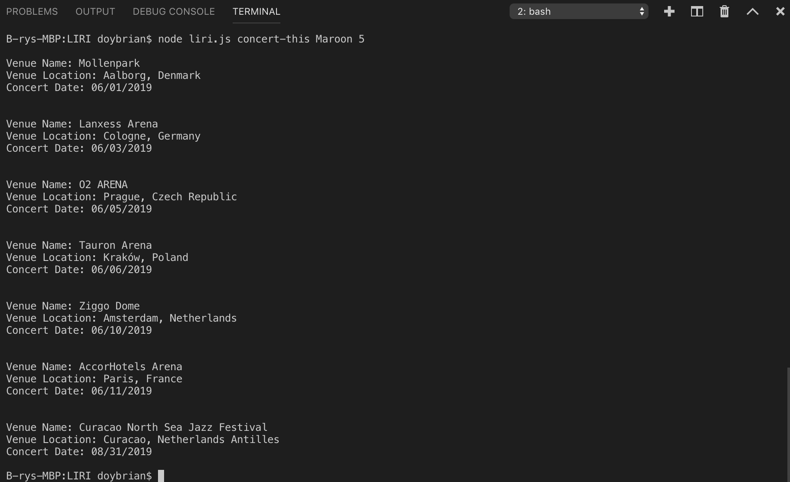
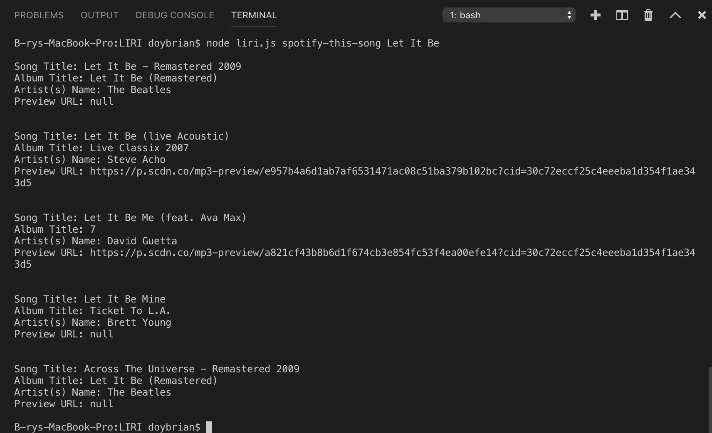
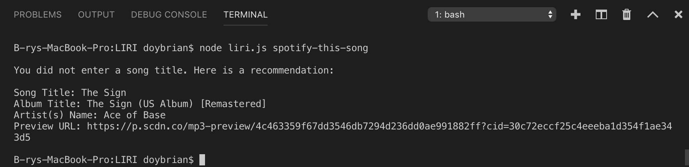
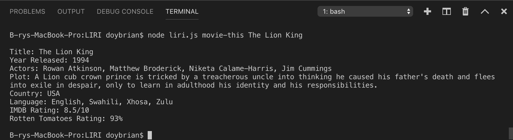
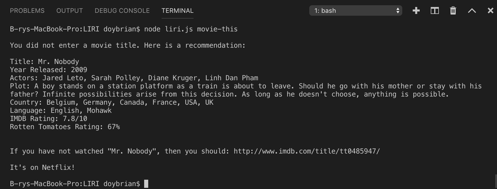
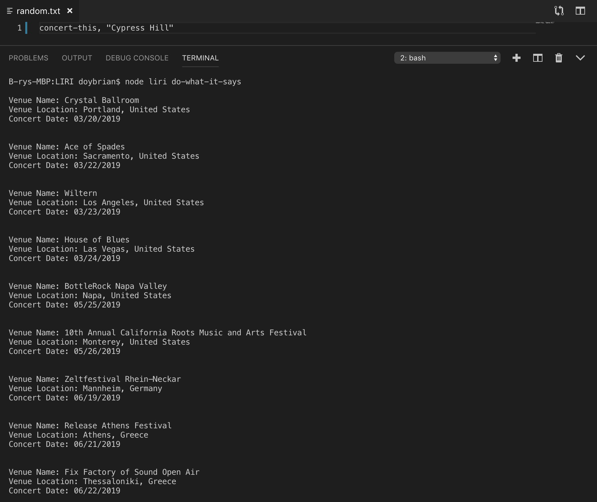
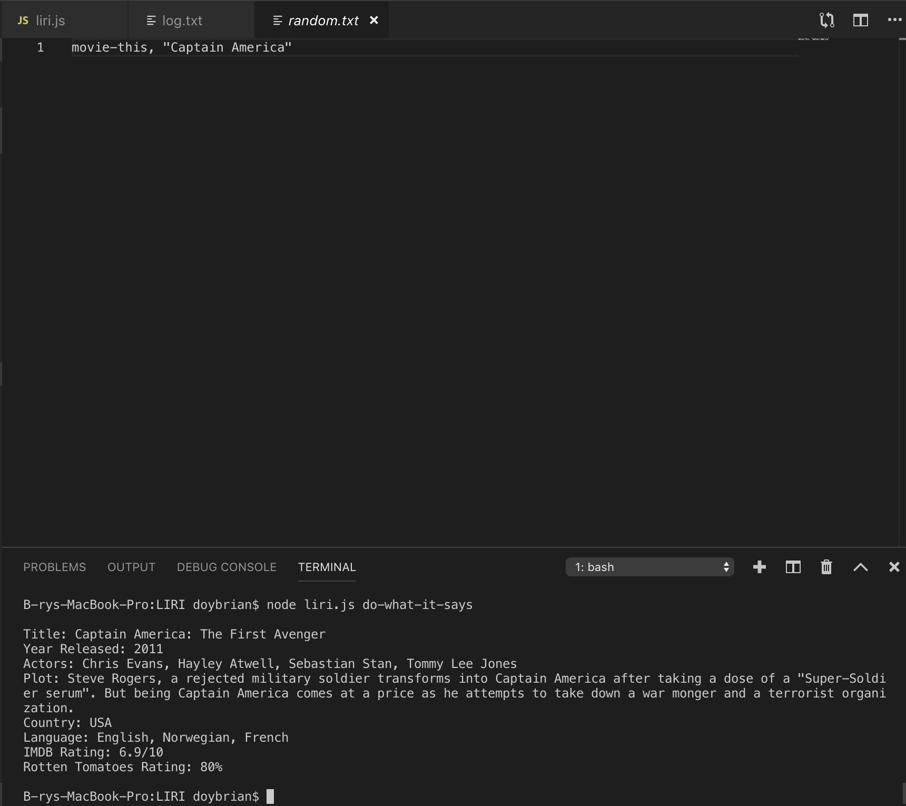
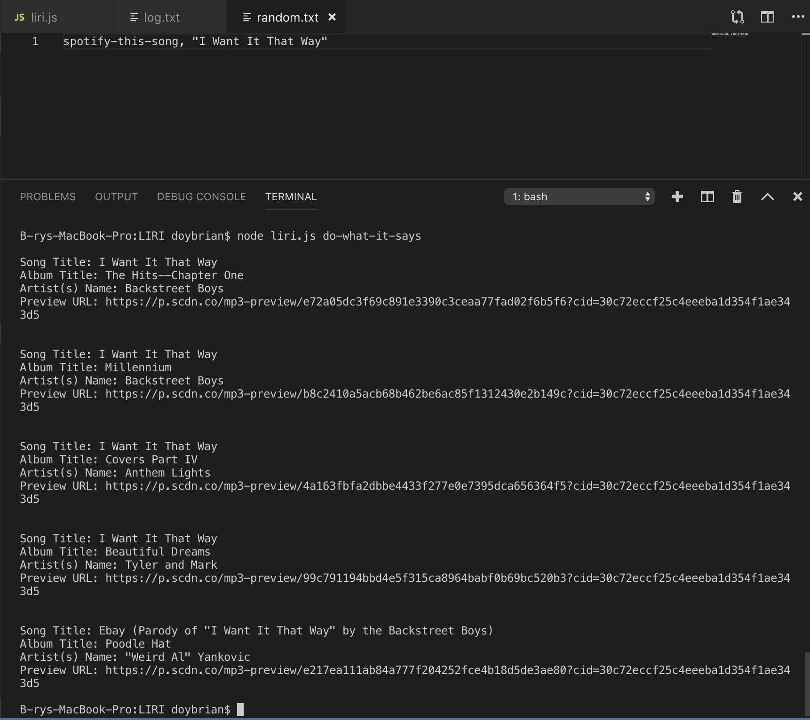

# LIRI
A command line node app that takes in parameters and gives you back data.

### Overview

LIRI is like iPhone's SIRI. However, while SIRI is a Speech Interpretation and Recognition Interface, LIRI is a _Language_ Interpretation and Recognition Interface. LIRI will search Spotify for songs, Bands in Town for concerts, and OMDB for movies.


### Instructions

1. liri.js file is created and can take in one of the following commands in node:

* `concert-this`

* `spotify-this-song`

* `movie-this`

* `do-what-it-says`


### What Each Command Should Do

1. `node liri.js concert-this <artist/band name here>`

* This will search the Bands in Town Artist Events API (`"https://rest.bandsintown.com/artists/" + artist + "/events?app_id=codingbootcamp"`) for an artist and render the following information about each event to the terminal:

* Name of the venue

* Venue location

* Date of the Event (use moment to format this as "MM/DD/YYYY")

<br>

* 

<br>

2. `node liri.js spotify-this-song '<song name here>'`

* This will show the following information about the song in your terminal/bash window

* Artist(s)

* The song's name

* A preview link of the song from Spotify

* The album that the song is from

* If no song is provided, the program will default to "The Sign" by Ace of Base.

* It will utilize the [node-spotify-api](https://www.npmjs.com/package/node-spotify-api) package in order to retrieve song information from the Spotify API.

<br>



<br>



<br>

3. `node liri.js movie-this '<movie name here>'`

* This will output the following information to your terminal/bash window:

```
* Title of the movie.
* Year the movie came out.
* IMDB Rating of the movie.
* Rotten Tomatoes Rating of the movie.
* Country where the movie was produced.
* Language of the movie.
* Plot of the movie.
* Actors in the movie.
```

* If the user doesn't type a movie in, the program will output data for the movie 'Mr. Nobody.'

* It'll use the `axios` package to retrieve data from the OMDB API. 

<br>



<br>



<br>

4. `node liri.js do-what-it-says`

* Using the `fs` Node package, LIRI will take the text inside of random.txt and then use it to call one of LIRI's commands.

* It should run `spotify-this-song` for "I Want it That Way," as follows the text in `random.txt`.

* The file random.txt can be edited to test out the feature for movie-this and concert-this.

<br>



<br>



<br>



<br>

### BONUS FEATURE

* In addition to logging the data to your terminal/bash window, the data will be output to a .txt file called `log.txt`.

* Every search results will append each command you run to the `log.txt` file.  It will not overwrite the file each time you run a command.

